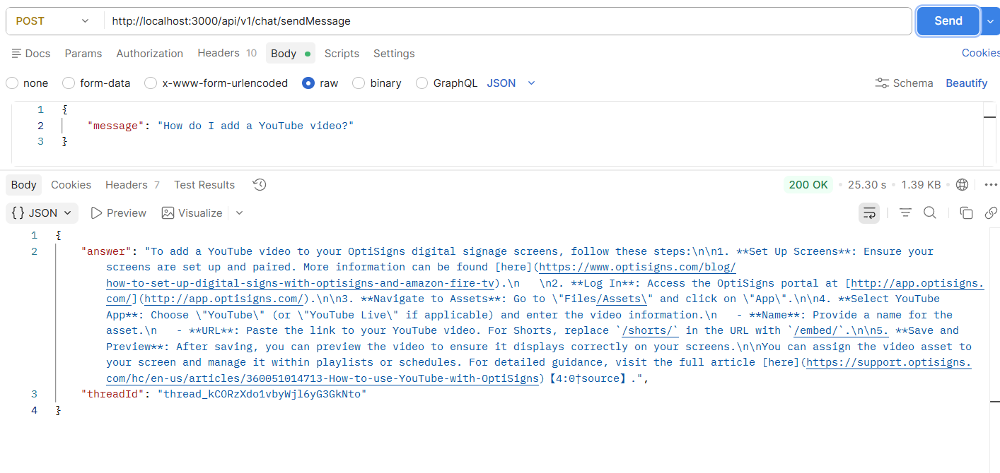

# OptiBot Mini-Clone

A minimal RAG-based customer support bot for OptiSigns, powered by the OpenAI Assistants API.

## Prerequisites

- Node.js 18+
- An OpenAI API key

## Setup

Install dependencies:

```bash
npm install
```

Create a local environment file:

```bash
copy NUL .env
```

Add the following variables to .env:

```env
OPENAI_API_KEY=your_openai_api_key
ASSISTANT_ID=
VECTOR_STORE_ID=
PORT=3000
```

## First-time setup: create Assistant and Vector Store

Run the setup script once to create the assistant and vector store:

```bash
npm run setup
```

The script will print the generated Assistant ID and Vector Store ID. Copy those values into your .env file.

## Run locally

Start the app:

```bash
npm start
```

The server will start at:

```text
http://localhost:3000
```

Test it with curl:

```bash
curl -X POST http://localhost:3000/api/v1/chat/sendMessage \
  -H "Content-Type: application/json" \
  -d '{"message": "How do I add a YouTube video?"}'
```

## Screenshot of assistant answering a sample question



## Run with Docker

Build the image:

```bash
docker build -t optibot .
```

Run the container:

```bash
docker run -e OPENAI_API_KEY=sk-xxx \
           -e VECTOR_STORE_ID=vs_xxx \
           -e ASSISTANT_ID=asst_xxx \
           -p 3000:3000 \
           optibot
```

## Chunking Strategy

The app uses OpenAI's default chunking behavior: about 800 tokens per chunk with 400-token overlap. 
Embedding model: text-embedding-3-large at 256 dimensions.
Maximum number of chunks added to context: 20 (could be fewer).
Each Markdown article should include an `Article URL:` line so the assistant can cite its source when answering.

